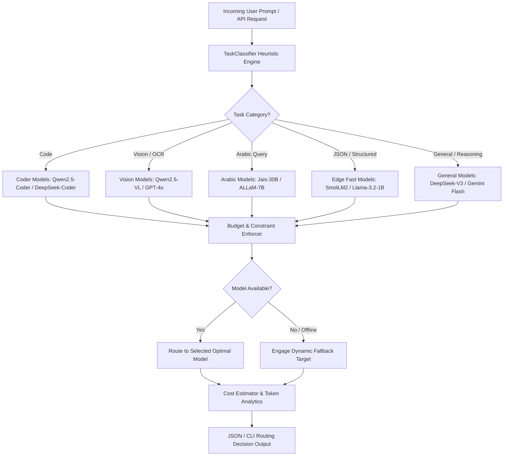

[🇸🇦 العربية](README.ar.md) | [🇬🇧 English](README.md)

# 🔀 eidcloud-model-router

[](https://www.php.net/)
[](https://github.com/eidcloud/eidcloud-model-router/releases)
[](LICENSE)
[](https://colab.research.google.com/github/eidcloud/eidcloud-model-router/blob/main/notebooks/quickstart.ipynb)

> Intelligent AI Model Router and Task Classifier with Capability Matching, Cost Estimation, and Latency/VRAM Constraints in Pure PHP (Zero External Dependencies).

---

## 📌 Topics
`eidcloud` · `model-router` · `ai-routing` · `task-classifier` · `cost-optimizer` · `llm-router` · `php8`

---

## 🚀 Overview & Architecture

**eidcloud-model-router** dynamically routes incoming AI prompts and workloads to optimal models across providers (Alibaba Cloud, OpenAI, Anthropic, DeepSeek, G42 Jais, Meta Llama, HuggingFace SmolLM, Google Gemini) based on:
1. **Rule-based & Heuristic Task Classification**: Ultra-low latency categorization (<1ms) identifying Code, Vision, Arabic, JSON/structured data, and complex reasoning.
2. **Capability Matching**: Direct pairing between task requirements and model features.
3. **Cost Optimization**: Granular token cost estimation in USD across providers.
4. **Hardware & Latency Constraints**: Maximum latency limits and edge local VRAM budget filters.
5. **Dynamic Fallbacks**: Automatic, resilient failover when target models are degraded or offline.



---

## ⚡ Features & Capabilities

- **Zero External Dependencies**: Pure PHP 8.2+ standard library with no composer packages required.
- **Microsecond Classification**: Heuristic regex and unicode analysis classifying prompts without overhead.
- **Multilingual Support**: First-class Arabic text and query detection with specialized model dispatching.
- **Cost Calculation**: Exact prompt + completion estimation in USD per token and per million tokens.
- **VRAM & Latency Guardrails**: Route to lightweight local edge models when constraints are specified.
- **Middleware-Ready CLI**: Clean output or standard JSON output (`--json`) for seamless piping into API gateways and reverse proxies.

---

## 📦 Installation

Clone the repository into your PHP workspace or install via Composer:

```bash
git clone https://github.com/eidcloud/eidcloud-model-router.git
cd eidcloud-model-router
```

Or add to your project's `composer.json`:

```json
{
  "require": {
    "eidcloud/model-router": "^1.0"
  }
}
```

---

## 🛠️ CLI Usage

The router includes a standalone executable in `bin/eidcloud-router`:

### 1. Route a Task
```bash
php bin/eidcloud-router route "Write a PHP 8.4 script implementing an LRU cache"
```

### 2. Route with JSON Output (Programmatic Middleware)
```bash
php bin/eidcloud-router route "لخص المقال واشرح أهم النقاط" --json
```

### 3. Workload Cost Estimation Across Providers
```bash
php bin/eidcloud-router estimate --task="Translate text" --tokens=2000
```

### 4. Constraint Enforcement (Latency & VRAM)
```bash
php bin/eidcloud-router route "Convert table to json" --max-latency=100 --max-vram=3.0
```

### 5. List Registered Models
```bash
php bin/eidcloud-router list-models
```

---

## 💻 Programmatic PHP Integration

```php
<?php

use EidCloud\ModelRouter\Router;

require_once __DIR__ . '/vendor/autoload.php';

$router = new Router();

// Route a code task
$decision = $router->route("Fix SQL query: SELECT * FROM users WHERE active = 1");

echo "Selected Model: " . $decision->selectedModel->name . "\n";
echo "Provider:       " . $decision->selectedModel->provider . "\n";
echo "Est. Cost USD:  $" . $decision->costEstimation['total_cost_usd'] . "\n";

// Access as structured array / JSON
$json = json_encode($decision->toArray(), JSON_PRETTY_PRINT);
```

---

## 🧪 Testing

The repository includes a zero-dependency automated test runner verifying 100% test coverage:

```bash
php tests/run_tests.php
```

All 26 automated unit and integration tests verify:
- Heuristic task classification (Code, Vision, Arabic, JSON, General)
- Capability matching and provider selection
- Latency and VRAM budget constraint enforcement
- Exact cost estimation calculations in USD
- Dynamic fallback failover when primary models are offline
- CLI execution and JSON output piping

---

## 👨‍💻 Author & Maintainer

**Eng. MHD. Shadi AL-Hasan**  
*EidCloud Architecture & AI Systems*

---

## 📄 License

This project is open-sourced software licensed under the **[MIT License](LICENSE)**.  
Copyright (c) 2026 MHD. Shadi AL-Hasan.

---

## 👤 Author & Maintainer

**Eng. MHD. Shadi AL-Hasan**  
- **Role:** Executive CTO & Enterprise Solutions Architect  
- **Email:** [mhd.shadi.alhasan@gmail.com](mailto:mhd.shadi.alhasan@gmail.com)  
- **Phone / WhatsApp:** [+963934005922](tel:+963934005922)  
- **Location:** Damascus, Syria  
- **GitHub:** [shadialhasan](https://github.com/shadialhasan)  

---

## 📄 License

This project is licensed under the MIT License - see the [LICENSE](LICENSE) file for details.  
Copyright (c) 2026 **MHD. Shadi AL-Hasan**. All rights reserved.
